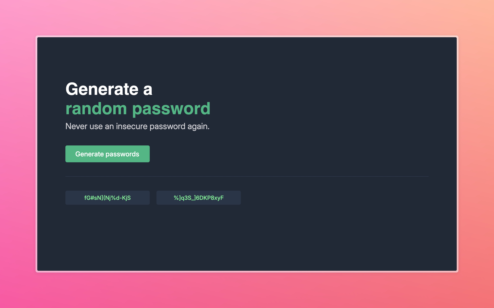

# Basic Password Generator

A small client-side password generator built with HTML, CSS and JavaScript. Generates secure passwords with 15 characters.

Usage
1. Open `index.html` in your browser.
2. Click the generate button.

Screenshot

